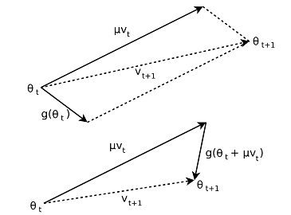

+++
title = "Optimizer"
date = 2018-11-20T20:52:06+08:00
draft = false

# Authors. Comma separated list, e.g. `["Bob Smith", "David Jones"]`.
authors = ["Jiaxin Gu"]

# Tags and categories
# For example, use `tags = []` for no tags, or the form `tags = ["A Tag", "Another Tag"]` for one or more tags.
tags = ["PyTorch"]
categories = []
math = true

# Projects (optional).
#   Associate this post with one or more of your projects.
#   Simply enter your project's folder or file name without extension.
#   E.g. `projects = ["deep-learning"]` references 
#   `content/project/deep-learning/index.md`.
#   Otherwise, set `projects = []`.
# projects = ["internal-project"]

# Featured image
# To use, add an image named `featured.jpg/png` to your page's folder. 
[image]
  # Caption (optional)
  caption = ""

  # Focal point (optional)
  # Options: Smart, Center, TopLeft, Top, TopRight, Left, Right, BottomLeft, Bottom, BottomRight
  focal_point = ""
+++

# 基类Optimizer
Optimizer类是PyTorch中所有优化器的基类，其主要功能体现在step()这一方法中，用于更新parameter。使用时，需要向其子类(SGD、Adam等)传递params与defaults两个参数，一个经典的例子如下：

```python
optimizer = torch.optim.SGD([
            {'params': model.conv1.parameters()},
            {'params': model.bn1.parameters()},
            {'params': model.relu.parameters()},
            {'params': model.maxpool.parameters()},
            {'params': model.layer1.parameters()},
            {'params': model.layer2.parameters()},
            {'params': model.layer3.parameters()},
            {'params': model.layer4.parameters()},
            {'params': model.avgpool.parameters()},
            {'params': model.fc.parameters(), 'lr': 0.01}
        ], lr=0.0, momentum=0.9)
``` 

 - **params**参数接收一个包含所有待优化的parameters的列表，其中每个元素是一个必须包含‘params’ key 的dict，‘params’的值可以为Variable构成的列表，也可以为由parameters()所生成的迭代器（详细原理请看nn.Module类）。其余key倘若与另一参数defaults相同，则可以省略，不同则需要单独指明。
 - **defauls**用于接收优化器的超参数（如学习率、动量等），它统一设定于之前没有特别指定超参数的params中。例子中，除了fc层的学习率都为0，实现了finetuning。
 

但是在实际使用时，模型的超参数一般一致，所以可以简化为:

```pyhon
    optimizer = torch.optim.SGD(model.parameters(),lr=0.01, momentum=0.9)
```
下面详细分析 class Optimizer(object)
理解Optimizer的关键在于理解其初始化
```python
    def __init__(self, params, defaults):
        # 检察params的合法性，必须为可迭代的Variable或者dict对象
        if isinstance(params, Variable) or torch.is_tensor(params):
            raise TypeError("params argument given to the optimizer should be "
                            "an iterable of Variables or dicts, but got " +
                            torch.typename(params))
        self.state = defaultdict(dict)
        self.param_groups = list(params)
        if len(self.param_groups) == 0:
            raise ValueError("optimizer got an empty parameter list")
        if not isinstance(self.param_groups[0], dict):
            # 如果params不是dict, 则转化为dict
            self.param_groups = [{'params': self.param_groups}]
        
        # 检查params的唯一性
        param_set = set() # 集合，每个元素互异
        for group in self.param_groups:
            if isinstance(group['params'], torch.autograd.Variable):
                group['params'] = [group['params']]
            else:
                group['params'] = list(group['params'])
            # group['params'] 是Variable构成的list
            # 该操作也影响了self.params_groups
            group_set = set(group['params'])
            if not param_set.isdisjoint(group_set): # 判断是否碰撞
                raise ValueError("some parameters appear in more than one "
                                 "parameter group")
            param_set.update(group_set) # 更新出现过的Variable集合
        for name, default in defaults.items(): # 所有超参数
            for i, group in enumerate(self.param_groups):
                if default is required and name not in group:
                    raise ValueError("parameter group " + str(i) + " didn't "
                                     "specify a value of required optimization parameter " +name)
                else:
                    group.setdefault(name, default)
                    # 为每个params dict设定所需的超参数
                    # 补全每个dict所省略的键与值
                    # self.param_group最后的形式为
                    # [{'params': [Variable_1, ...], ‘lr’:0.01, 
                    #  'momentum':0.9,...}, ...]
        for group in self.param_groups:
            for param in group['params']:
                # 检查是否为Variable
                if not isinstance(param, Variable):
                    raise TypeError("optimizer can only optimize Variables, "
                                    "but one of the params is " + torch.typename(param))
                # 检查是否需要计算梯度
                if not param.requires_grad:
                    raise ValueError("optimizing a parameter that doesn't "
                                     "require gradients")
                # 检查是否为叶节点（.creator=None）
                if not param.is_leaf:
                    raise ValueError("can't optimize a non-leaf Variable")  
``` 
                    
抛开众多错误检查，Optimizer.\_\_init\_\_()的核心是：

    
```python
self.param_groups = [{'params': [Variable_1, ...], 'lr':0.01, 'momentum':0.9,...}, ...]
```
self.param_groups 是Optimizer的核心概念，理解其结构组成之后，很容易就能理解state_dict、load_state_dict等输出、加载optimizer状态的方法了。

Optimzier中另外一个常用的方法是zero_grad()，其作用是清空每个Variable的grad，在每次调用backward()前使用。
```python
    def zero_grad(self):
        """Clears the gradients of all optimized :class:`Variable` s."""
        for group in self.param_groups:
            for p in group['params']:
                if p.grad is not None:
                    if p.grad.volatile:
                        p.grad.data.zero_()
                    else:
                        data = p.grad.data
                        p.grad = Variable(data.new().resize_as_(data).zero_()) 
```
基类Optimzier中并没有实现step()，而是交由其子类根据不同的策略设计不同的step()方法

----------
# SGD：Stochastic Gradient Gescent
随机梯度下降法：对于训练数据集，我们首先将其分成n个batch，每个batch包含m个样本。我们每次更新都利用一个batch的数据，而非整个训练集。即：

$$v\_t = −ηg\_t$$

$$θ\_{t+1} = θ_t + v\_t$$

其中，$η$为学习率，$g\_t$为$θ$在$t$时刻的梯度。
**Momentum**：SGD方法的一个缺点是，其更新方向完全依赖于当前的batch，因而其更新十分不稳定。解决这一问题的一个简单的做法便是引入momentum。momentum即动量，它模拟的是物体运动时的惯性，即更新的时候在一定程度上保留之前更新的方向，同时利用当前batch的梯度微调最终的更新方向。这样一来，可以在一定程度上增加稳定性，从而学习地更快，并且还有一定摆脱局部最优的能力：

$$v\_{t+1} = μv\_t − ηg\_t$$

$$θ\_{t+1} = θ\_t + v\_{t+1}$$

其中，$η$为学习率，$μ$为momentum系数，$g\_t$为$θ$在$t$时刻的梯度。

**Nesterov Momentum**：这是对传统momentum方法的一项改进，由Ilya Sutskever在Nesterov工作的启发下提出的。

$$v\_{t+1} = μv\_t − ηg\_t(θ\_t+μv\_t )$$

$$θ\_{t+1} = θ\_t + v\_{t+1}$$

其中，$η$为学习率，$μ$为momentum系数，$g\_t(θ\_t+μv\_t )$为$θ$在$t$时刻于$θ\_t+μv\_t$处的梯度

<center>

</center>
<center>(Top) Classical Momentum
(Bottom) Nesterov Accelerated Gradient</center>

NAG按照原来的更新方向更新一步，然后在该位置计算梯度值，然后用这个梯度值修正最终的更新方向。NAG与CM不同之处在于计算梯度的位置不同。

详细介绍可以参考[这篇博文](http://blog.csdn.net/luo123n/article/details/48239963)

言归正传，pytorch里面的SGD中step()方法如下：
```python
    def step(self, closure=None):
        """Performs a single optimization step.

        Arguments:
            closure (callable, optional): A closure that reevaluates the model
                and returns the loss.
        """
        loss = None
        if closure is not None:
            loss = closure()

        for group in self.param_groups:
            # 4个超参数，当nesterov=True时，dampening必须为0
            weight_decay = group['weight_decay']
            momentum = group['momentum']
            dampening = group['dampening']
            nesterov = group['nesterov']

            for p in group['params']:
                if p.grad is None:
                    continue
                d_p = p.grad.data
                if weight_decay != 0: # L2 penalty
                    d_p.add_(weight_decay, p.data) #d_p = d_p + weight_decay * p.data
                if momentum != 0:
                    param_state = self.state[p]
                    if 'momentum_buffer' not in param_state:
                        # 第1代
                        buf = param_state['momentum_buffer'] = d_p.clone()
                    else:
                        # 第n代（n>=2）,取上一代的buf
                        buf = param_state['momentum_buffer']
                        # 注意！！buf指向了param_state['momentum_buffer']
                        # 注意！！改变buf的操作也会改变param_state['momentum_buffer']
                        buf.mul_(momentum).add_(1 - dampening, d_p)
                        # buf = buf * momentum + (1 - dampening) * d_p
                    if nesterov:
                        d_p = d_p.add(momentum, buf)
                        # d_p = d_p + momentum * buf
                    else:
                        d_p = buf
                # p.data = p.data - lr * d_p
                p.data.add_(-group['lr'], d_p)
                
        return loss  
```
分3种情况讨论（不考虑第一代的情况）：

1) $momentum = 0$：

 $$p.data_{t+1} = p.data_t - lr \times d\_p$$

即普通SGD算法

2) $momentum > 0\ and \ nesterov = False$:  此时dampening没有限制.

$$buf\_{t+1}= buf\_t \times momentum + (1 - dampening) \times d\_p$$

$$p.data\_{t+1} = p.data\_t - lr \times buf\_{t+1}$$

与CM略有区别（$\times$学习率的位置不一样），但仍属于CM家族

3) $momentum > 0\ and\ nesterov = True$: 此时dampening必须为0.

$$buf\_{t+1} = buf\_t \times momentum + d\_p$$

$$d\_p' = d\_p + momentum \times buf\_{t+1}$$

$$p.data\_{t+1} = p.data\_t - lr \times d\_p'$$
看不懂在算些什么...好在一般SGD都不用nesterov...........

----------
# Adam
Adam(Adaptive Moment Estimation)本质上是带有动量项的RMSprop，它利用梯度的一阶矩估计和二阶矩估计动态调整每个参数的学习率。Adam的优点主要在于经过偏置校正后，每一次迭代学习率都有个确定范围，使得参数比较平稳。公式如下：

$$m\_t=\beta\_1m\_{t-1}+(1-\beta\_1)g\_t$$

$$v\_t=\beta\_2v\_{t-1}+(1-\beta\_2)g\_t^2$$

$$\hat{m\_t}=\frac{m\_t}{1-\beta\_1^t}$$

$$\hat{v\_t}=\frac{v\_t}{1-\beta\_2^t}$$

其中，$m\_t$,$v\_t$分别是对梯度的一阶矩估计和二阶矩估计，可以看作对期望$E|g\_t|$，$E|g\_t^2|$的估计；$\hat{m\_t}$,$\hat{v\_t}$是对$m\_t$,$v\_t$的校正，这样可以近似为对期望的无偏估计。 可以看出，直接对梯度的矩估计对内存没有额外的要求，而且可以根据梯度进行动态调整，而$\frac{\eta}{\sqrt{\hat{v\_t}}+\epsilon}$对学习率形成一个动态约束，而且有明确的范围。

$$\theta\_{t+1}=\theta\_{t}-\frac{\eta}{\sqrt{\hat{v\_t}}+\epsilon}\hat{m\_t}$$

PyTorch中实现Adam的代码如下：
```python
    def step(self, closure=None):
        """Performs a single optimization step.

        Arguments:
            closure (callable, optional): A closure that reevaluates the model
                and returns the loss.
        """
        loss = None
        if closure is not None:
            loss = closure()

        for group in self.param_groups:
            for p in group['params']:
                if p.grad is None:
                    continue
                grad = p.grad.data
                state = self.state[p]

                # State initialization
                if len(state) == 0:
                    state['step'] = 0
                    # Exponential moving average of gradient values
                    state['exp_avg'] = grad.new().resize_as_(grad).zero_()
                    # Exponential moving average of squared gradient values
                    state['exp_avg_sq'] = grad.new().resize_as_(grad).zero_()
                # exp_avg, exp_avg_sq 分别对应公式中的mt与vt 
                exp_avg, exp_avg_sq = state['exp_avg'], state['exp_avg_sq']
                beta1, beta2 = group['betas']

                state['step'] += 1

                if group['weight_decay'] != 0:
                    grad = grad.add(group['weight_decay'], p.data)

                # Decay the first and second moment running average coefficient
                exp_avg.mul_(beta1).add_(1 - beta1, grad) # 更新mt
                exp_avg_sq.mul_(beta2).addcmul_(1 - beta2, grad, grad) # 更新vt

                denom = exp_avg_sq.sqrt().add_(group['eps']) # √vt + eps

                bias_correction1 = 1 - beta1 ** state['step'] # 1 - beta1的t次方
                bias_correction2 = 1 - beta2 ** state['step'] # 1 - beta2的t次方
                step_size = group['lr'] * math.sqrt(bias_correction2) / bias_correction1
                # step_size = lr * √(1 - beta2^t) / 1 - beta1^t
                p.data.addcdiv_(-step_size, exp_avg, denom)
                # p.data = p.data - lr * √(1 - beta2^t) * mt / (1 - beta1^t) * ( √vt +
                #          eps) = p.data - lr * mt_hut / √(vt_hut 
                #          + eps/bias_correction2)

        return loss 
```
